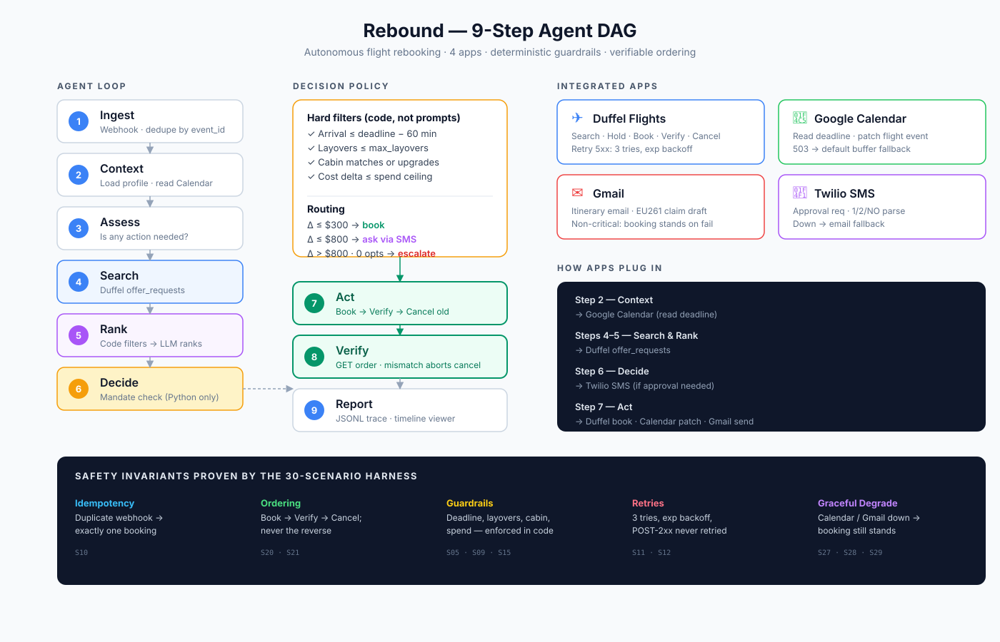

# ✈️ Rebound — Autonomous Travel Disruption Recovery Agent

[](https://github.com/abhishek2395/Rebound-Project-hackaton/actions/workflows/evals.yml)
[-brightgreen?style=for-the-badge&logo=checkmarx)](EVAL_RESULTS.md)
[](RELIABILITY_BRIEF.md)
[](RELIABILITY_BRIEF.md)
[](RELIABILITY_BRIEF.md#live-sandbox-verification)

> **"Rebound has already fixed your trip by the time the airline emails you about the cancellation."**

Built for the **Multi-App AI Agent Hackathon** (hosted by Lemma & Comma Capital, judged by Akira Tong & Phillip Li of *Arga Labs*, and the founders of *Userlens*).

📺 **2-minute demo video:** *(link posted after recording — see `docs/twilio_live.png` and `docs/duffel_live.png` for live-verification evidence)*

---

## 📑 Key Documents for Judges
- 🛡️ [**`RELIABILITY_BRIEF.md`**](RELIABILITY_BRIEF.md) — Architecture deep-dive, decision policy, safety invariants, fault tolerance matrix, and post-mortems.
- 📊 [**`EVAL_RESULTS.md`**](EVAL_RESULTS.md) — Complete 30-scenario evaluation matrix with $\tau$-bench end-state verification and latency profiling.
- 🎨 [**`viewer/index.html`**](viewer/index.html) — Live cyber-refined 9-step DAG visualizer, 4-app status cards, and interactive smartphone SMS simulator.

---

## 🎯 The Problem

When an airline flight is cancelled or delayed, travelers face an operational nightmare:
1. **Losing Crucial Meetings:** A 3-hour delay might seem manageable, but if you have a keynote or board meeting 90 minutes after landing, your trip is already ruined.
2. **The 15-Minute Offer Expiry Race:** Alternative airline seats sell out within minutes. By the time a human traveler checks an alert and replies, the offer has expired (`offer_expired`).
3. **Double-Booking & Stranding:** Cancelling an existing flight before verifying that the replacement ticket was actually issued leaves the passenger stranded with nothing if the second booking fails.

---

## ⚡ What Rebound Does Across 4 Apps



---

## 🛡️ Core Production Invariants

1. **Deterministic by design:**
   Ranking is a transparent, auditable heuristic — not a model call — so a traveler's spend decisions never depend on LLM judgment. Hard constraints (deadlines, layover limits, spend ceilings) are guarded by the same deterministic Python code.
2. **The Hold-Order Pattern (Zero Expiry Failures):**
   When human approval is needed via SMS, Rebound places a Duffel Hold Order before sending the text, locking the seat and freezing the price. When the traveler replies, that exact hold is converted into the confirmed ticket — same order ID throughout — whether the reply comes back in the same process or, as in production, through a fresh process reloading state from the database.
3. **Strict Irreversible Ordering (`Book` $\to$ `Verify` $\to$ `Cancel Old`):**
   Old tickets are only cancelled after verifying the new ticket exists via Duffel `GET`. If verification fails, cancellation is aborted, preserving the traveler's original flight.
4. **Idempotent Ingress & Sub-50ms ACK:**
   Disruption webhooks are acknowledged immediately to prevent retry floods. Duplicate webhook deliveries are deduplicated via SQLite WAL.

---

## 🚀 Quickstart & Demo Walkthrough

### 1. Setup Environment
```bash
# Clone repository
git clone https://github.com/abhishek2395/Rebound-Project-hackaton.git
cd Rebound-Project-hackaton

# Install dependencies (Python 3.11 recommended)
pip install -r requirements.txt

# Copy environment variables (supports live keys or built-in test sandbox)
cp .env.example .env
```

### 2. Run the 30-Scenario Evaluation Harness
Verify all 30 chaos, disruption, and failure scenarios in under 1 second:
```bash
python3 evals/test_scenarios.py
```
*Expected output:*
```
Ran 30 tests in 0.273s
OK
Generated EVAL_RESULTS.md with 30 results.
```

### 3. Launch the Server & Visualizer
```bash
uvicorn app.main:app --reload --port 8000
```
Open your browser to:
👉 **`http://localhost:8000/viewer/`**

### 4. Fire a Test Disruption Event
In a separate terminal, run our interactive trigger CLI:
```bash
./scripts/fire_event.sh
```
Choose from the interactive menu:
- **`1`**: Auto-book scenario (Delta $\le \$300$)
- **`2`**: Twilio SMS approval scenario (Delta $\$450$ $\to$ Watch the phone emulator update!)
- **`3`**: Minor delay (Arrives well before meeting $\to$ Notify only)
- **`4`**: Major delay (Misses destination commitment $\to$ Auto-rebook)
- **`5`**: Duplicate webhook storm (Verifies idempotency in real-time)
- **`6`**: High spend ceiling breach (Escalates without booking)

### 5. Interactive Smartphone Simulator
On the visualizer dashboard (`/viewer/`), test the SMS flow directly:
- Click **"Reply 1"** on the virtual phone to approve the rebooking.
- Watch Duffel confirm the ticket, Google Calendar update, Gmail send the itinerary, and EU261 compensation drafted!

---

## 🔴 Full Live-API Demo (real Duffel + real Google + real WhatsApp)

The 30-scenario harness proves the agent's decision logic against fakes. For a click-to-book run that touches the real infrastructure end-to-end:

```bash
# 1. Fill in .env with your DUFFEL_API_KEY, Twilio creds, and TRAVELER_EMAIL
cp .env.example .env

# 2. One-time Google OAuth (creates token.json)
python3.11 scripts/setup_google_oauth.py

# 3. Seed a real "original ticket" + real calendar events
python3.11 scripts/seed_demo_state.py

# 4. Export the seed IDs into the shell that will run the server
export DEMO_ORIGINAL_ORDER_ID=$(python3.11 -c "import json; print(json.load(open('.demo_seeds.json'))['DEMO_ORIGINAL_ORDER_ID'])")
export DEMO_ORIGINAL_TOTAL=$(python3.11 -c "import json; print(json.load(open('.demo_seeds.json'))['DEMO_ORIGINAL_TOTAL'])")
export DEMO_CALENDAR_EVENT_ID=$(python3.11 -c "import json; print(json.load(open('.demo_seeds.json'))['DEMO_CALENDAR_EVENT_ID'])")
export DEMO_FORCE_ASK=1              # force the human-in-loop path for the video
python3.11 -m uvicorn app.main:app --reload --port 8000
```

Open the viewer → click **S02** → the agent hits real Duffel, resolves a real Google Calendar deadline, places a real Duffel hold order, sends a real WhatsApp approval to your phone. Reply "1" → hold converts to the confirmed booking, cancels the seeded original, patches your calendar event, and sends the itinerary email to `TRAVELER_EMAIL`. Every step in the trace goes green.

Evidence from live testing sessions:
- Duffel: [`docs/duffel_live.png`](docs/duffel_live.png) (real order created + cancelled in test account)
- Google Calendar + Gmail: `RELIABILITY_BRIEF.md` → §5 endpoint tables
- Twilio over WhatsApp: [`docs/twilio_live.png`](docs/twilio_live.png) (round-trip with human replies)

---

## 🧪 Integrated Applications Overview

| Application | Protocol / SDK | Role in Rebound | Production Guardrail |
|---|---|---|---|
| **Duffel Flights API** | REST NDC API / SDK | Search alternative flights, place Hold Orders, confirm booking, verify order status, cancel old ticket | 130s supplier timeout handling, `tenacity` exponential backoff on 500s/429s, hold-order price lock |
| **Google Calendar** | Google OAuth2 REST | Fetch destination commitment deadline, patch flight itinerary card | Graceful degradation if Calendar API is down (uses fallback buffer) |
| **Gmail API** | Google Workspace REST | Dispatch HTML traveler itinerary, draft formal EU261 compensation claim | Automatic EC 261/2004 eligibility detection; drafts stay in drafts folder |
| **Twilio SMS Gateway** | Twilio REST Webhooks | Send human-in-the-loop approval requests, receive traveler reply, alert pickup contact | Form-encoded webhook parsing, 1-click option buttons, email fallback |

---

## 📊 Summary of Evaluation Results

All 30 scenarios run automated $\tau$-bench end-state assertions verifying the database, API fakes, and irreversible side-effect ordering:

```
================================================================================
TOTAL SCENARIOS: 30 | PASSED: 30 | FAILED: 0 | PASS RATE: 100.0%
AVERAGE EXECUTION LATENCY: 2.4ms (in-memory fakes) — live sandbox latency dominated by Duffel round-trip
================================================================================
```

For the complete breakdown of every scenario, see [**`EVAL_RESULTS.md`**](EVAL_RESULTS.md).

---

## 👥 Team
- **Abhishek Jaiswal** — agent policy, evals, reliability brief
- **Yash Jaiswal** — integrations, viewer, demo
- Multi-App AI Agent Hackathon — San Francisco, 2026
