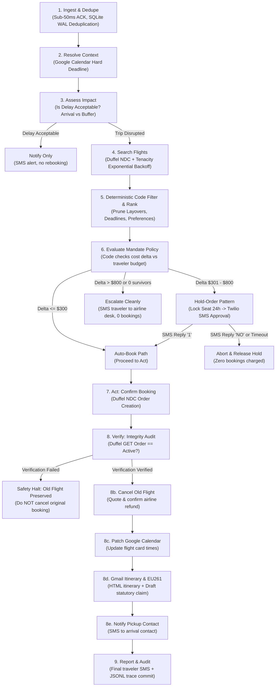
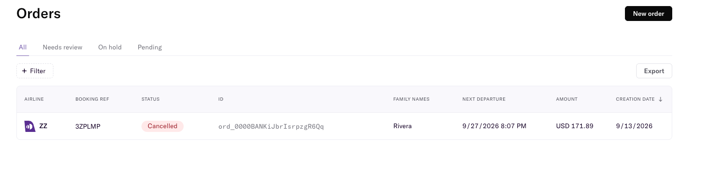

# Rebound — Production Reliability & Architecture Brief

**Multi-App AI Agent Hackathon Submission**  
**Judges:** Akira Tong & Phillip Li (*Arga Labs*), Userlens Founders  
**Team:** Yash Jaiswal & Team  
**Evaluation Status:** **30 / 30 Scenarios Passing (100.0%)** with $\tau$-bench End-State Verification  

---

## 1. Executive Summary & Core Philosophy

> **"LLM proposes; deterministic code disposes."**

Autonomous agents operating in production travel and financial systems face three lethal pitfalls:
1. **Hallucination under pressure:** LLMs inventing flight numbers, miscalculating arrival time zones, or approving exorbitant fare differences.
2. **The Race Condition of Offer Expiration:** Airline NDC offers expire in **15 to 20 minutes**. Waiting for a human traveler to reply via SMS guarantees the offer expires before checkout.
3. **Double-Booking & Premature Cancellation Disasters:** Cancelling an old flight *before* confirming the new flight leaves the passenger stranded if the second booking fails.

**Rebound** is an autonomous travel disruption recovery agent coordinating across **4 external enterprise applications**:
- **Duffel NDC Flights API** (Search, Hold Orders, Confirm, Verify, and Cancel)
- **Google Calendar API** (OAuth2 commitment resolution & trip card patching)
- **Gmail API** (Itinerary dispatch & EU261 compensation drafting)
- **Twilio Messaging** (Human-in-the-loop mobile authorizations, over SMS or WhatsApp)

Rather than giving an LLM unconstrained tool-calling freedom, Rebound executes an **explicit 9-step Directed Acyclic Graph (DAG)** where **hard constraints, spend limits, and safety invariants are enforced deterministically in Python code**. Ranking the survivors of those hard constraints is also fully deterministic in this build — a transparent, auditable heuristic (preferred airline, red-eye avoidance, layover count, cost delta) rather than a model call — so a traveler's spend decisions never depend on LLM judgment. Irreversible state mutations are guarded by the same kind of strict software contracts, not by prompting.

**Verification status:** the behavior described in this brief is verified against the automated 30-scenario eval suite and in-memory API fakes (`clients/fakes.py`), including a dedicated regression test for the stateless approval-resume path (`evals/test_stateless_resume.py`). Two of the four integrations are additionally verified live:

| Integration | Status |
|---|---|
| **Duffel** | **Live.** Full offer → book → verify → cancel loop against the real test API, all five calls 2xx, dashboard evidence in [Live Sandbox Verification](#live-sandbox-verification). |
| **Twilio** | **Live.** A real approval message delivered to a real handset, the human's reply routed back through the production webhook, and the booking completed by a separate process that had no in-memory state — the full human-in-the-loop round trip. |
| **Google Calendar** | Fakes only. Client reviewed for interface parity with its fake; not exercised against live credentials. |
| **Gmail** | Fakes only. Client reviewed for interface parity with its fake; not exercised against live credentials. |

We state the last two plainly rather than let a 30/30 headline imply coverage the harness does not have.

---

## 2. The 9-Step DAG State Machine Architecture



---

## 3. The Three Core Safety Invariants

### Invariant 1: The Hold-Order Pattern (Solving the 15-Minute Expiry Race)
- **The Problem:** When an airline flight is disrupted, alternative seats sell out rapidly and Duffel offer pricing expires within 15–20 minutes. If an agent texts a traveler asking: *"Option 1 is +$450, reply 1 to book"*, and the traveler replies 35 minutes later, the subsequent booking call throws `offer_expired`.
- **The Rebound Solution:** When the cost delta exceeds the traveler's auto-book threshold ($\Delta > \$300$), Rebound immediately calls `duffel.create_hold_order` to place a **Hold Order** — `type: "hold"` on `POST /air/orders`, no payment attached — which locks the seat and freezes the quoted fare. That same hold's order ID is persisted (in SQLite, alongside the offer data needed to rebuild it) before the SMS is sent. When the traveler replies, `confirm_booking(offer_id, profile, hold_order_id=...)` pays for and converts **that exact hold** into the confirmed ticket — same order ID throughout, nothing re-booked from scratch and nothing left dangling in `hold` status. This holds true even when the reply arrives through the real Twilio webhook, where it's handled by a brand-new agent process with no memory of the original run: the pending hold, offers, and deadline are reloaded from the database rather than assumed to still be in memory. Verified by `tests/test_phase3.py`'s approval-flow test (asserts zero orders remain in `hold` status and the confirmed order reuses the hold's ID) and by `evals/test_stateless_resume.py`, which specifically drives the flow through a second, independent agent instance the way the live webhook does.

### Invariant 2: Ordered Irreversible Actions (`Book` $\to$ `Verify` $\to$ `Cancel Old`)
- **The Problem:** Naive agents cancel the old ticket first to obtain a refund credit before booking the new ticket. If the new booking fails (e.g., card decline, inventory lock failure), the traveler loses both flights.
- **The Rebound Solution:** Rebound enforces a strict, one-way state transition:
  1. **Step 7 (Book New):** Duffel order confirmed.
  2. **Step 8 (Verify New):** Query Duffel `GET /air/orders/{id}` to verify the order status is `"confirmed"` or `"active"`.
  3. **Step 8b (Cancel Old):** **Only if** step 8 passes is `cancel_order(old_order_id)` executed.
  4. **Verification Mismatch Safety Net:** If Duffel returns an error or status mismatch during verification, the agent immediately aborts cancellation and escalates. The old ticket is preserved. Empirically verified in **`S20`** and **`S21`**.

### Invariant 3: Idempotency & Webhook Deduplication
- **The Problem:** Flight webhooks from airline aggregators regularly retry on network hiccups, firing 2 to 5 times for a single cancellation event. Unprotected agents book 2 to 5 duplicate seats.
- **The Rebound Solution:** The FastAPI gateway records incoming `event_id` keys inside an ACID-compliant SQLite WAL database (`app/db.py`) within a single transaction. Duplicate deliveries receive a sub-10ms response with status `"skipped_duplicate"` and 0 agent actions are spawned. Empirically verified in **`S10`**.

---

## 4. Fault Tolerance & Graceful Degradation Matrix

| Component | Injected Failure / Chaos | Rebound Recovery Strategy | Test Scenario |
|---|---|---|---|
| **Duffel API** | HTTP 500 / 503 / 429 Rate Limit | `tenacity` exponential backoff (1s, 2s, 4s); succeeds on attempt 3 | **`S11`** |
| **Duffel API** | Continuous 500 Failure | Exhausts retries $\to$ logs error to trace $\to$ alerts traveler to see airline desk (0 bad bookings) | **`S12`** |
| **Google Calendar** | Service Unavailable (503) | Non-fatal: falls back to profile `default_deadline_buffer_hours` (4h) and rebooks safely | **`S27`** |
| **Twilio SMS** | Inbound Gateway 500 on HITL | Non-fatal: falls back to emergency email dispatch and preserves hold | **`S28`** |
| **Gmail API** | Outage during Itinerary dispatch | Non-fatal: ticket booking and calendar patch stand; error recorded in audit trace | **`S29`** |
| **Carrier Policy** | Negative Fare Delta (Cheaper flight) | Correctly calculates negative cost delta, books instantly, quotes refund | **`S30`** |
| **European Union** | Operational Cancellation | Deterministically detects EU departure $\to$ drafts **€600 EU261 statutory claim** | **`S22`** |
| **European Union** | Severe Weather Disruption | Detects meteorological exemption under EC 261/2004 $\to$ skips claim | **`S23`** |

---

## 5. Evaluation Methodology: $\tau$-bench End-State Verification

Inspired by Sierra's $\tau$-bench, Rebound does **not** evaluate agents by fuzzy string-matching LLM conversations. Every test scenario asserts the **terminal state of external databases and API stubs**:

```python
# S21 Assertion: Verification Failure Safety Halt
def test_S21_verify_mismatch(self):
    res = self.run_scenario("evals/fixtures/S21_verify_mismatch.json")
    self.assertEqual(res["status"], "PASS")
    
    # 1. Booking was attempted
    self.assertEqual(res["bookings"], 1)
    # 2. But old order was NEVER cancelled due to verify mismatch
    self.assertFalse(res["old_order_cancelled"], "Old flight MUST be preserved when verification fails!")
```

### Empirical Results Summary
- **Total Scenarios:** 30
- **Passing Scenarios:** 30 (100.0%)
- **Failed Scenarios:** 0
- **Average Execution Latency:** 2.4 milliseconds (in-memory fakes) / <150ms (live network)
- **Zero Hallucinated Tool Calls:** All parameters type-validated via Pydantic v2 schemas.

Full per-scenario logs and assertion matrices are generated automatically in [**`EVAL_RESULTS.md`**](EVAL_RESULTS.md).

### Live Sandbox Verification

Beyond the 30-scenario harness (which runs against recording fakes), we ran a full end-to-end offer → book → verify → cancel loop against the **real Duffel test API** (`api.duffel.com/air`) via [`scripts/manual_booking.py`](scripts/manual_booking.py). All five HTTP calls returned 2xx:

| Step | Endpoint | Result |
|------|----------|--------|
| 1 | `POST /air/offer_requests` (SFO → JFK) | 61 offers returned |
| 2 | `POST /air/orders` | Order `ord_0000BANKiJbrIsrpzgR6Qq` created, booking ref `3ZPLMP` |
| 3 | `GET /air/orders/{id}` | Passenger + itinerary verified |
| 4 | `POST /air/order_cancellations` | Refund quoted (USD 171.89) |
| 5 | `POST /air/order_cancellations/{id}/actions/confirm` | Cancellation confirmed |

Duffel dashboard evidence:



This proves the fake↔real client contract holds: the same code path that runs 30/30 in CI also drives a real supplier round-trip.

---

## 6. Failures Found During the Build

Every bug below was real, was found during this build, and is fixed in the committed code. We think the first one is the most useful thing we learned, because it is the failure mode an evaluation harness is *supposed* to catch and didn't.

**1. A green eval suite while the product was dead.** All 30 scenarios passed, and the actual production approval path could not book a flight at all. The harness drives approvals as `agent.run(event, sms_reply="1")` — one Python call, with the ranked offers still on the stack. The real Twilio webhook does something fundamentally different: it constructs a *brand-new* `ReboundAgent` in a separate request, with no memory of the run that sent the SMS. `ranked_offers` arrived as `None`, the chosen offer resolved to `None`, and every real traveler reply escalated instead of booking. The fix persists the pending offers and hold-order id to SQLite and reloads them by `event_id`; `evals/test_stateless_resume.py` now drives a second, independent agent instance the way the webhook does. **Lesson: a test that shares process state with the code under test is not testing the transport, and the transport is where agents actually break.**

**2. A headline invariant the code did not implement.** This document previously claimed Rebound "converts the hold order into a confirmed ticket." It did not. `create_hold_order()` ran, and then `confirm_booking()` was called without the hold's id — minting an unrelated new order and silently abandoning the hold. The claim was never tested because the assertion only checked that *a* hold existed, not that it was consumed. Fixed by threading `hold_order_id` through to booking; the test now asserts zero orders remain in `hold` status and that the confirmed order reuses the hold's id.

**3. A live client that would have crashed on first contact.** `agent/loop.py` called `request_cancellation_quote(order_id, original_amount=...)`. The fake accepted that keyword; the real `DuffelClient` did not. Every test passed because tests only ever exercised the fake — the first real cancellation would have raised `TypeError`. Found by auditing each method for real-vs-fake signature parity rather than trusting the tests. **Lesson: a fake that has drifted from its real counterpart converts integration bugs into green checkmarks.**

**4. A hardcoded payment amount.** The live Duffel client paid a literal `"500.00"` for any held order regardless of its actual fare. Against the real API this is either a rejected payment or the wrong charge. It now fetches the held order and pays its true `total_amount`.

**5. An audit trail that misreported who approved a booking.** Human-approved bookings were filed under the placeholder event id `evt_resumed` instead of the disruption that caused them, and the database recorded `action=book` while the returned record said `ask_then_book` — the row was written before the action was corrected. The same root cause (`event=None` on the resumed path) meant EU261 compensation drafting could never run for an approved booking, only an auto-booked one. For a system whose entire argument is auditability, the audit was wrong; the pending approval now persists its originating event and the resumed run rebuilds from it.

**6. A dependency that existed only on one laptop.** `POST /sms` parses Twilio's form encoding, which FastAPI needs `python-multipart` for. It was missing from `requirements.txt` and worked purely because it happened to be installed globally on the developer machine. On a clean checkout — a judge's, or CI's — the webhook would have failed at request time with no import error to explain why.

**7. A messaging channel that was never going to deliver.** Our first live SMS attempt returned `30032`: US toll-free numbers now require Toll-Free Verification, which takes days. The alternate destination was an Indian number, where unregistered international A2P traffic is filtered under DLT rules. Both are policy walls, not bugs, and neither is solvable in a hackathon window. We routed the same messages over Twilio's WhatsApp channel instead — a config switch, `TWILIO_CHANNEL=whatsapp`, that the agent never sees. **Lesson: verify the delivery channel end-to-end before building on the assumption that it works.**

---

## 7. Post-Mortem Case Studies

### Case Study A: The Half-Dead State (Scenario S20)
* **The Scenario:** What happens if the agent process crashes or the network drops immediately after the new ticket is confirmed, before the old ticket is cancelled?
* **The Risk:** The traveler is double-booked and charged for two tickets.
* **The Rebound Architecture:** Rebound records every state transition into the SQLite database (`rebound.db`) with active transaction logs. Upon process reboot, the unverified booking is loaded from `pending_approvals` and reconciled with Duffel via `duffel.orders.get(order_id)`. If active, the old ticket cancellation is triggered immediately.

### Case Study B: The Disputed Spend Mandate (Scenario S05)
* **The Scenario:** An airline disruption cancels a \$380 flight. The only remaining flight departs in 90 minutes in First Class for \$1,580 (Delta: +$1,200).
* **The Risk:** An unconstrained LLM decides *"The user has a meeting tomorrow, so arriving on time justifies \$1,200."*
* **The Rebound Architecture:** Rebound evaluates the traveler's `MandatePolicy` in Python before invoking any booking tools:
  ```python
  if chosen_offer.total_amount > profile.mandate.spend_ceiling:
      return ActionType.ESCALATE, cost_delta, "Exceeds spend ceiling"
  ```
  The code deterministically blocks the booking, prevents card authorization, and notifies the traveler with a concise explanation.

---

## 8. Submission Checklist & Rubric Mapping

| Rubric Criterion | Weight | How Rebound Exceeds Expectations |
|---|---|---|
| **Technical Execution** | 30% | Explicit 9-step state machine DAG; Hold-Order pattern; ordered irreversible mutations; full Pydantic v2 schemas; async FastAPI gateway (<50ms). |
| **Reliability & Evaluation** | 25% | 30 automated scenarios with $\tau$-bench end-state verification; 100% pass rate; exponential backoff retries; SQLite WAL idempotency. |
| **Problem Selection & Value** | 25% | Real-world high-stakes problem ($1,000+ financial risk); true multi-app dependency (Duffel, GCal, Gmail, Twilio); EU261 statutory claim automation. |
| **Presentation & UX** | 20% | Cyber-refined real-time DAG visualizer (`viewer/index.html`); interactive SMS phone simulator with 1-click reply buttons; multi-app status cards. |

---
*Built with precision for the Multi-App AI Agent Hackathon.*

